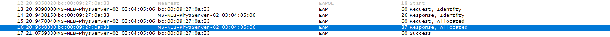
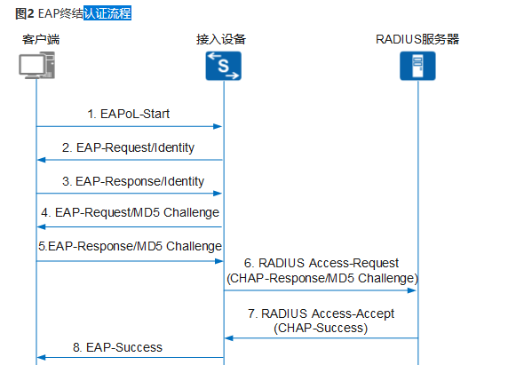
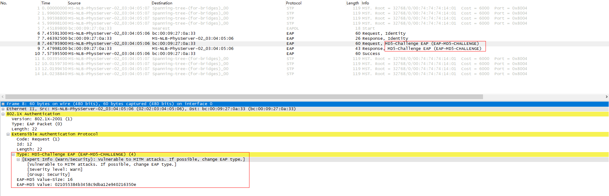

# 802.1X PAP 抓包

```
[HUAWEI]interface 10GE 1/0/4                                                                                                        
[HUAWEI-10GE1/0/4]dis this                                                                                                          
2021-03-22 18:49:43.743                                                                                                             
#                                                                                                                                   
interface 10GE1/0/4   

 ~port link-type access 
 
 port default vlan 10                                                                                                               
 authentication-profile zwx                                                                                                         
 device transceiver 1000BASE-T                                                                                                      
#                                                                                                                                   
return                                                                                                                              
[HUAWEI-10GE1/0/4]q                                                                                                                 
[HUAWEI]authentication-profile name zwx                                                                                             
[HUAWEI-authen-profile-zwx]dis this                                                                                                 
2021-03-22 18:50:46.903                                                                                                             
#                                                                                                                                   
authentication-profile name zwx                                                                                                     
 dot1x-access-profile zwx                                                                                                           
 authentication timer handshake-period 5                                                                                            
 access-domain zwx                                                                                                                  
#                                                                                                                                   
return                                                                                                                              
[HUAWEI-authen-profile-zwx]q                                                                                                        
[HUAWEI]aaa                                                                                                                         
[HUAWEI-aaa]domain zwx                                                                                                              
[HUAWEI-aaa-domain-zwx]dis this                                                                                                     
2021-03-22 18:51:13.645                                                                                                             
 domain zwx                                                                                                                         
  authentication-scheme zwx                                                                                                         
  accounting-scheme default                                                                                                         
  radius-server zwx                                                                                                                 
#                                                                                                                                   
return                                                                                                                              
[HUAWEI-aaa-domain-zwx]q                                                                                                            
[HUAWEI-aaa]radius                                                                                                                  
[HUAWEI-aaa]q                                                                                                                       
[HUAWEI]radius                                                                                                                      
[HUAWEI]radius-server t zwx                                                                                                         
[HUAWEI-radius-zwx]dis this                                                                                                         
2021-03-22 18:52:05.41                                                                                                              
#                                                                                                                                   
radius-server template zwx                                                                                                          
 radius-server shared-key cipher %@%##!!!!!!!!!"!!!!#!!!!*!!!!O["l~SnwG70'}/MB0`\6'T]V>I"L@)M9t6O!!!!!!!!!!!!!!!;!!!!o"<jU6F^u.+%,N&
@\8W2sHv!SzA$V4vhkmK!!!!!%@%#                                                                                                       
 radius-server accounting 120.92.27.70 1813 weight 80                                                                               
 radius-server authentication 120.92.27.70 1812 weight 80                                                                           
 undo radius-server user-name domain-included                                                                                       
#                                                                                                                                   
return                                                                                                                              
[HUAWEI-radius-zwx]q                                                                                                                
[HUAWEI]dot1x-ac                                                                                                                    
[HUAWEI]dot1x-access-profile name zwx                                                                                                                                                                            
[HUAWEI-dot1x-access-profile-zwx]dis this                                                                                           
2021-03-22 18:52:44.945                                                                                                             
#                                                                                                                                   
dot1x-access-profile name zwx                                                                                                       
 dot1x authentication-method pap                                                                                                    
#                                                                                                                                   
return                                                                                                                              
[HUAWEI-dot1x-access-profile-zwx] 
```

接口 `10GE 1/0/4`, 绑定认证模板`zwx`和`vlan 10`

认证模板`zwx`绑定dot1x接入模板`zwx`和接入域`zwx`

dot1x接入模板`zwx`使用`pap`认证方法

接入域`zwx`绑定radius认证模板`zwx`和认证方案`zwx`还有计费方案

抓到的报文如下



对应802.1X认证流程中的



PAP认证方式下设备发出去的第4个报文为`Request, Identity`报文

CHAP认证方式下发出去的报文为`Request， MD5-Challenge EAP`报文，如下图

 